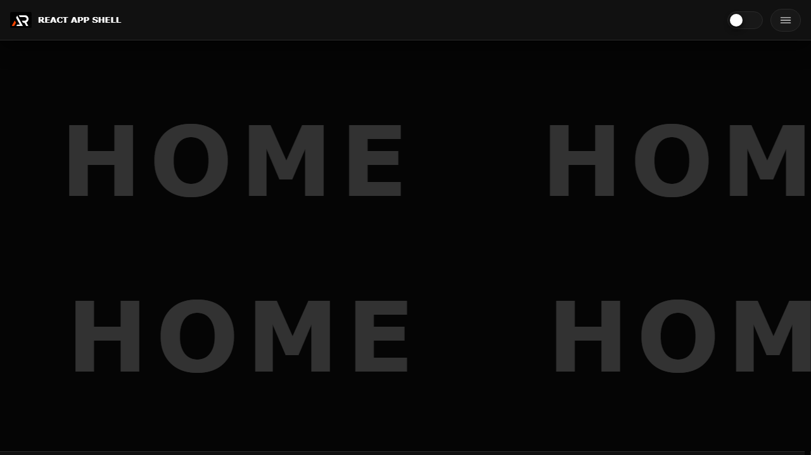

# React App Shell

A reusable React and Vite starter with a fixed header, theme switching, responsive drawer navigation, lazy routes and a small set of layout primitives.



## Features

- Dark and light themes persisted in local storage
- Fixed branded header with responsive menu drawer
- Searchable, collapsible navigation groups
- Lazy-loaded routes with a loading fallback
- Responsive global styles, surfaces and scrollbars
- Reusable full-screen scrolling placeholder component

## Tech stack

React, Vite, React Router, styled-components, Material UI and React Icons.

## Run locally

```bash
npm install
npm run dev
```

## Deploy

```bash
npm run deploy
```

## Links

- Portfolio: [https://www.ashishranjan.net](https://www.ashishranjan.net)
- GitHub: [https://github.com/a2rp](https://github.com/a2rp)
- CodePen: [https://codepen.io/ash1198](https://codepen.io/ash1198)
- LinkedIn: [https://www.linkedin.com/in/aashishranjan](https://www.linkedin.com/in/aashishranjan)
- Facebook: [https://www.facebook.com/theash.ashish/](https://www.facebook.com/theash.ashish/)
- YouTube: [https://www.youtube.com/@ashishranjan-ashz?sub_confirmation=1](https://www.youtube.com/@ashishranjan-ashz?sub_confirmation=1)
- Email: [ash.ranjan09@gmail.com](mailto:ash.ranjan09@gmail.com)

## Support

- Support: [https://a2rp-donation-page.netlify.app/](https://a2rp-donation-page.netlify.app/)
- Buy Me a Coffee: [https://buymeacoffee.com/a2rp](https://buymeacoffee.com/a2rp)
- Patreon: [https://patreon.com/a2rp](https://patreon.com/a2rp)
