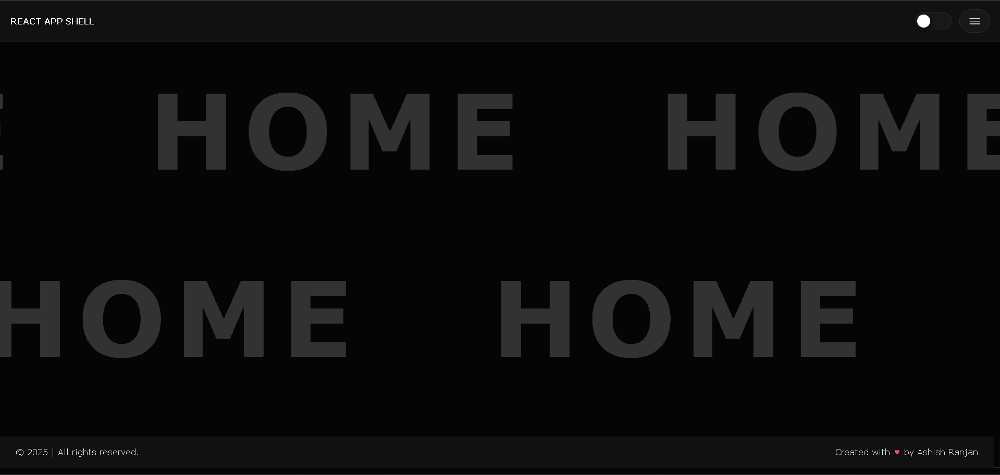
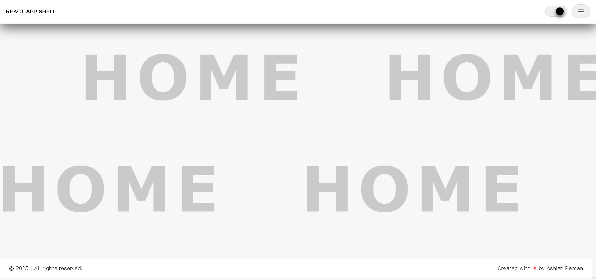
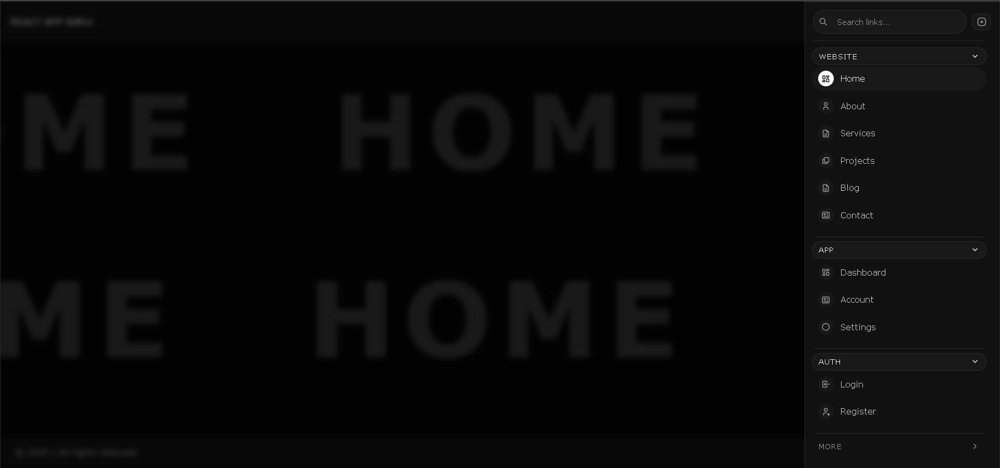

# React App Shell – Styled Components Starter

This repo is a reusable **base structure** for new React apps.  
Instead of rebuilding layout, header, theme logic, navigation, and placeholder pages every time, this shell acts as a starter template that can be cloned and customized for any project.

-   **Repo:** https://github.com/a2rp/react-app-shell
-   **Live demo:** https://a2rp.github.io/react-app-shell

---



# dark theme



# light theme



# side drawer menu

---

## Why this exists

Whenever a new React project starts, a lot of time goes into the same initial setup:

-   Basic routing and layout
-   Header with brand and menu
-   Mobile-friendly side drawer
-   Dark / light theme and global styles
-   Placeholder pages to wire up navigation

This starter puts all of that into one place so that new apps can start from a stable base instead of from zero.  
The idea is simple:

-   Clone this repo
-   Rename what is needed (brand, routes, labels)
-   Replace placeholder screens with real pages

---

## Tech Stack

-   **Build tool:** Vite
-   **UI library:** React
-   **Styling:** `styled-components`
-   **Routing:** React Router
-   **Icons:** `react-icons` (Tabler icon set)
-   **Loader:** MUI `CircularProgress` used in the `Suspense` fallback

---

## Key Features

### 1. Global Theme with Dark / Light Mode

Theme tokens are defined in `src/theme.css`:

-   Background, surfaces, borders
-   Text and muted text
-   Headings
-   Links and hover states
-   Shadows and radii
-   Scrollbar colors

There are two modes:

-   **Dark theme (default)** – defined on `:root`
-   **Light theme** – defined on `html[data-theme="light"]`

A theme toggle in the header:

-   Switches between light and dark
-   Writes the current theme to `localStorage`
-   Reads from `localStorage` on load so the preference persists after refresh

### 2. Global Base Styles

`src/index.css` provides:

-   Basic reset (`margin`, `padding`, `box-sizing`)
-   Typography defaults for body and headings
-   Styling for:
    -   Links
    -   Lists
    -   Tables
    -   Forms and inputs
    -   Buttons
    -   Code blocks and `pre`
    -   Blockquotes
-   Utility `.surface` and `.surface-soft` classes for quick panels
-   A theme-aware custom scrollbar that:
    -   Is stable (no layout jump)
    -   Changes thumb visibility and color based on hover and device type

This makes every app built on this shell visually consistent from the start.

### 3. Layout Shell

Main layout is handled by `App.styled.js`:

-   **Header** fixed at the top
-   **Main** content area scrolls with a custom scrollbar
-   Optional **side drawer** that appears on top for navigation on smaller screens

Key styled components:

-   `Styled.Wrapper`
-   `Styled.Main`
-   `Styled.RoutesWrapper`
-   `Styled.Drawer`

The drawer includes:

-   A dimmed, blurred background
-   A right-side panel for navigation
-   Click outside to close

### 4. Header with Theme Toggle and Drawer Trigger

`src/components/header`:

-   Displays brand name (`React App Shell` by default)
-   Contains:
    -   Theme toggle (pill with a moving ball)
    -   Menu button to open the drawer

Theme toggle:

-   Reads initial theme from `document.documentElement`
-   Uses `localStorage` to persist theme
-   Updates `data-theme` attribute on `<html>`

### 5. Responsive Drawer + Navigation with Search

`src/components/navlinks`:

-   Navigation is grouped into sections:

    -   **Website:** Home, About, Services, Projects, Blog, Contact
    -   **App:** Dashboard, Account, Settings
    -   **Auth:** Login, Register
    -   **More:** FAQ, Privacy, Terms, Changelog

-   Features:

    -   Section headers are collapsible
    -   The section containing the current route auto-expands
    -   A **search bar** filters links by label/path
        -   Search results auto-expand relevant sections
        -   Clear (`X`) button appears when search is non-empty
    -   A close button in the nav header to close the drawer
    -   Icons for each nav item using `react-icons/tb`
    -   Active link highlight with pill-style UI

This makes it easy to adapt the navigation to different types of apps (portfolio, dashboard, client panel, etc.) just by editing the `NAV_DATA` structure.

### 6. Routing Setup

`src/AppRoutes.jsx`:

-   Uses `React.lazy` and `Suspense` for lazy-loaded pages
-   Shows full-screen loader (`CircularProgress`) while a route is loading
-   Default routes include:

    -   `/home`, `/about`, `/services`, `/projects`, `/blog`, `/contact`
    -   `/dashboard`, `/account`, `/settings`
    -   `/login`, `/register`
    -   `/help/faq`, `/legal/privacy`, `/legal/terms`, `/changelog`
    -   `*` → NotFound page

Routes point to page components under `src/pages/...`, which can initially be simple placeholders and later evolved into full UI.

### 7. Full-Screen Scrolling Placeholder Component

`src/components/fullScreenScroller`:

-   A reusable full-screen page component used as a placeholder
-   Displays a large scrolling label that fills the width of the screen
-   Two rows:

    -   Top row scrolls in one direction
    -   Bottom row scrolls in the opposite direction

-   Uses duplicated content and a shared keyframe animation for seamless looping

Example usage in any page:

```jsx
import FullScreenScroller from "../../components/fullScreenScroller";

const Home = () => {
    return <FullScreenScroller label="Home" />;
};

export default Home;
```

```
git clone https://github.com/a2rp/react-app-shell.git
cd react-app-shell
npm install
npm run dev

```
